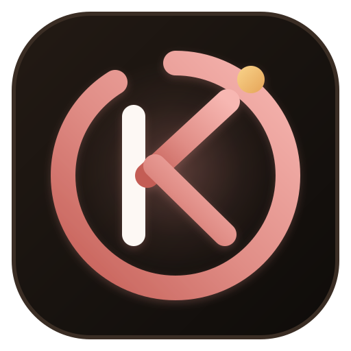

# ⛩️ Kaizen — Continuous Improvement Task Planner & Exam-Prep Suite

<div align="center">
  
  <h3>"1% better every single day."</h3>
  <p><strong>A minimalist, high-focus daily, weekly, and monthly goal and task planner built as an installable Progressive Web App (PWA) with bulletproof 5-tier persistence, touch swipe gestures, voice dictation, customizable Pomodoro focus timer, due time push notifications, 90-day study heatmap, task notes/descriptions, and Master Task Explorer.</strong></p>
  <p>
    <a href="https://kaizen-0.web.app/USER_GUIDE.html"><strong>📖 Open User Guide & Manual (Printable PDF)</strong></a> •
    <a href="https://kaizen-0.web.app"><strong>🌐 Live Web App</strong></a>
  </p>
</div>

---

## 🌟 Executive Overview

**Kaizen** (改善) is an intentional personal execution and exam-preparation platform designed for high-focus students, developers, founders, and professionals. Rooted in the Japanese philosophy of continuous incremental progress (`(1.01)³⁶⁵ = 37.78x`), it balances high-level strategic vision with daily execution across three temporal tiers (**Day**, **Week**, and **Month**) while providing master search archives, study habit analytics, and offline-first cloud sync reliability.

---

## 🚀 Key Features Breakdown

### 📈 1. Consistency Streak & 90-Day Study Heatmap Dashboard
- **Visual Contribution Grid**: 90-day activity matrix (similar to GitHub's contribution graph) with 4 activity intensity levels.
- **Interactive Dates**: Hover to see tasks completed on any date; click any heatmap square to jump the planner directly to that day.
- **Core Metrics Overview**:
  - 🔥 **Current Streak** (consecutive days of completed tasks)
  - 🏆 **Best Streak** (all-time longest streak)
  - ✅ **Total Completed Tasks**
  - ⏱️ **Total Focus Hours Logged**

---

### 🔔 2. Due Time Notifications & Customizable Pomodoro Focus Timer
- **Customizable Pomodoro Durations**:
  - Customize Focus Time (5 to 90 mins, default 25m)
  - Customize Short Break (1 to 30 mins, default 5m)
  - Customize Long Break (5 to 45 mins, default 15m)
  - Toggle Synthesizer Bell Chime & Web Push Notifications
- **Live Background Tracking**: Live countdown displayed in the browser tab title `(24:45) Kaizen`.
- **Due Time Reminder Engine**:
  - Type `@10:30am`, `@2:15pm`, or `@16:00` in any task to create a due time stamp.
  - Background scanner automatically triggers native browser push notifications when tasks are due!

---

### 📋 3. Master Task Explorer, Archive & Task Notes / Descriptions
- **Task Notes & Descriptions**:
  - Expand any task to add detailed study notes, formulas, reference links, or assignment descriptions (`task.note`).
  - Displays a clean note preview pill when collapsed.
- **Master Task Explorer Modal (`E` or `/`)**:
  - **Temporal Filter Tabs**: Filter tasks by **Today**, **This Week**, **This Month**, **This Year**, or **All-Time**.
  - **Status Filter**: View **All**, **Pending ⏳**, or **Completed ✅** tasks.
  - **Multi-Field Live Search**: Search simultaneously across task titles, subtasks, `#hashtags`, `@times`, and **detailed descriptions/notes** with instant 60fps responsiveness.
  - **1-Click Jump**: Click "🚀 Jump to Date" on any searched task to navigate straight to that day in the main planner.

---

### 📱 4. Mobile-First Touch & Hardware Integrations
- **👆 Touch Swipe Gestures**: Swipe Left / Right anywhere on the screen to flip seamlessly between **Yesterday $\leftrightarrow$ Today $\leftrightarrow$ Tomorrow**.
- **📳 Haptic Vibration Feedback**: Subtle physical tactile clicks (`navigator.vibrate(15)`) on mobile when completing tasks, creating subtasks, or finishing timer sessions.
- **🎙️ Voice-to-Task Dictation**: Tap the microphone button $\rightarrow$ speak your task or chapter $\rightarrow$ automatically transcribes and adds the item hands-free using the browser Web Speech API.
- **📲 Installable PWA (100% Offline)**:
  - **iOS (iPhone/iPad)**: Safari $\rightarrow$ Share $\rightarrow$ **Add to Home Screen** (full-screen standalone app).
  - **Android**: Chrome $\rightarrow$ **Install App** / **Add to Home screen**.
  - **Desktop**: Chrome / Edge $\rightarrow$ **Install App**.

---

### 🎓 5. Exam Preparation & Study Workflow Utilities
- **⏳ D-Day / Exam Countdown Pill**: Pin your target exam or deadline (e.g., *"NEET in 45 Days"*, *"Semester Finals in 18 Days"*) at the top of the header.
- **🧠 1-Click Spaced Repetition Auto-Scheduler**: Click **"Spaced Revision"** on any topic or chapter to automatically schedule revision reminder tasks on **Day +1, Day +3, and Day +7**.
- **🏷️ Subject & Module Hashtags**:
  - Type hashtags like `#Physics`, `#OrganicChemistry`, `#PYQ`, `#MockTest`, `#Revision`, `#Urgent`.
  - Automatically color-coded with harmonic pastel badges.
  - **Click any hashtag** to instantly filter tasks by that specific subject!

---

### 🛡️ 6. Bulletproof 5-Tier Data Persistence (Zero Data Loss)
Engineered so you **never lose data** on page refresh, browser cache clearing, or device switching:
1. **Tier 1 — Multi-Key Storage**: Dual writes synchronously to `localStorage` (`planner-dwm`, `planner-dwm-backup-v1`) and `sessionStorage`.
2. **Tier 2 — IndexedDB Database (`TaskPlannerDB`)**: Stores binary-resilient state records immune to standard session and cookie clearing.
3. **Tier 3 — Browser Storage Protection (`navigator.storage.persist()`)**: Requests persistent storage permission so Chrome will not evict your data during disk cleanup.
4. **Tier 4 — Firebase Firestore Cloud Sync**:
   - **Google Sign-In**: 1-click Google OAuth authentication to bind tasks to your personal account.
   - **Secret Sync Passcode**: Pair devices with a simple token (e.g. `MY-STUDY-99`) for 2-way real-time sync across computers, tablets, and phones.
5. **Tier 5 — Pre-Unload Lifecycle Flush**: Automatically commits active typing fields and notes before the page closes or reloads.

---

### 🌐 7. Data Portability & Document Export Hub
- **Instant Cloud Snapshot Link**: Compresses and encodes the current planner state into a standalone base64 URL hash (`#share=<encodedPayload>`) for 1-click sharing.
- **Formatted Text (.txt) Download**: Generates human-readable, beautifully structured text documents with checkboxes (`[✓]`), notes, and checklists for Notepad, TextEdit, and mobile devices.
- **Dedicated PDF & Clean Document Generation**: Prints or downloads standalone high-resolution HTML/PDF documents containing 100% of task contents, subtask checklists, and study notes with zero UI clutter.
- **JSON Backup & 1-Click Restore**: Full JSON state export with safety confirmation safeguards.

---

## ⌨️ Keyboard Shortcuts Reference

| Shortcut | Action | Description |
| :--- | :--- | :--- |
| <kbd>N</kbd> | **New Task** | Focuses task input field immediately |
| <kbd>T</kbd> | **Today** | Jumps to the current date |
| <kbd>1</kbd> / <kbd>2</kbd> / <kbd>3</kbd> | **Day / Week / Month** | Switches temporal view mode |
| <kbd>J</kbd> or <kbd>←</kbd> | **Previous Date** | Shifts back 1 day/week/month (or Swipe 👉) |
| <kbd>K</kbd> or <kbd>→</kbd> | **Next Date** | Shifts forward 1 day/week/month (or Swipe 👈) |
| <kbd>P</kbd> | **Pomodoro** | Starts or pauses customizable focus timer |
| <kbd>E</kbd> / <kbd>/</kbd> | **Master Explorer** | Opens Master Archive & multi-temporal search |
| <kbd>H</kbd> | **Heatmap** | Opens 90-day study heatmap & streak dashboard |
| <kbd>S</kbd> | **Share Plan** | Opens shareable link generator |
| <kbd>?</kbd> | **Shortcuts** | Opens keyboard cheatsheet modal |
| <kbd>Enter</kbd> | **Save / Add** | Adds task or commits inline edit |
| <kbd>Esc</kbd> | **Cancel / Close** | Closes open modal dialogs |

---

## 🚀 Online Publishing & Firebase Cloud Database Deployment

### Step 1: Deploy with Firebase Hosting & Firestore Cloud Sync
```bash
# Navigate to project root
cd D:\Kshetriva_farms\HiddenWave

# Deploy both Hosting and Firestore Database security rules
firebase deploy
```

*Or to deploy only hosting assets:*
```bash
firebase deploy --only hosting
```

Your app will be live with full SSL, global CDN edge caching, and real-time database sync at:
- **`https://hiddenwave.in/kaizen`**
- **`https://hiddenwave.in/planner`**

### Step 2: Local Testing
```bash
python -m http.server 8089 --directory "D:\Kshetriva_farms\HiddenWave\Projects\Task_Planner"
```
Open **`http://localhost:8089`** in your browser.

---

## 📂 File Structure

```
Task_Planner/
├── index.html                     # Semantic HTML5 shell, PWA metadata, Firebase SDK tags
├── styles.css                     # Responsive design system, dark/light themes, heatmap, notes, print
├── app.js                         # Core engine, heatmap, customizable pomodoro, due notifications, explorer
├── manifest.json                  # PWA installation manifest configuration
├── sw.js                          # Service Worker for offline caching and fast loads
├── icon.svg                       # Scalable vector Kaizen brand logo & favicon
├── USER_GUIDE.html                # Standalone visual User Guide & Printable Manual (Save as PDF)
├── Planner_ Day, Week, Month.html # Backward-compatible redirect
└── README.md                      # Comprehensive project documentation
```

---

<div align="center">
  <p>Crafted for focus & clarity • <a href="https://hiddenwave.in" target="_blank">HiddenWave.in</a></p>
</div>
